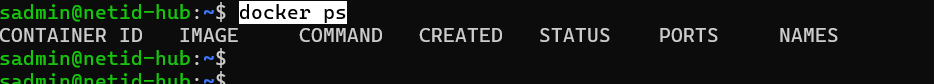
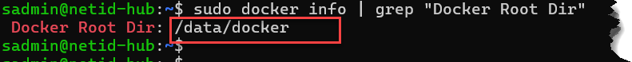

# PHASE 1

**Mục tiêu:**
  - Auth user
  - Gán VLAN
  - Quản lý user qua GUI 

## 👉 1. KIỂM TRA QUYỀN

- Thêm user sadmin vào group docker

    ```bash
    sudo usermod -aG docker sadmin

    grep docker /etc/group
    newgrp docker
    docker ps           # không sudo
    ```

    

- Docker Root Dir

    ```bash
    docker info | grep "Docker Root Dir"
    ```

    

## 👉 2 DỰNG MYSQL (CORE DB):

- Cài MySQL

```bash
curl -s https://raw.githubusercontent.com/khanhvc-doc/NetID-HUB/refs/heads/master/install_mysql.sh | sudo bash
```

- Test

```bash

docker logs -f mysql
ready for connections

docker exec -it mysql mysql -u root -p
# Thông tin
#
# MYSQL_ROOT_PASSWORD="root123"
# MYSQL_DATABASE="radius"
# MYSQL_USER="radius"
# MYSQL_PASSWORD="radius123"
```


## 👉 2 CÀI FreeRADIUS + MySQL

```bash
curl -s https://raw.githubusercontent.com/khanhvc-doc/NetID-HUB/refs/heads/master/install_radius.sh | sudo bash
```


👉 Step 3:

Gắn GUI